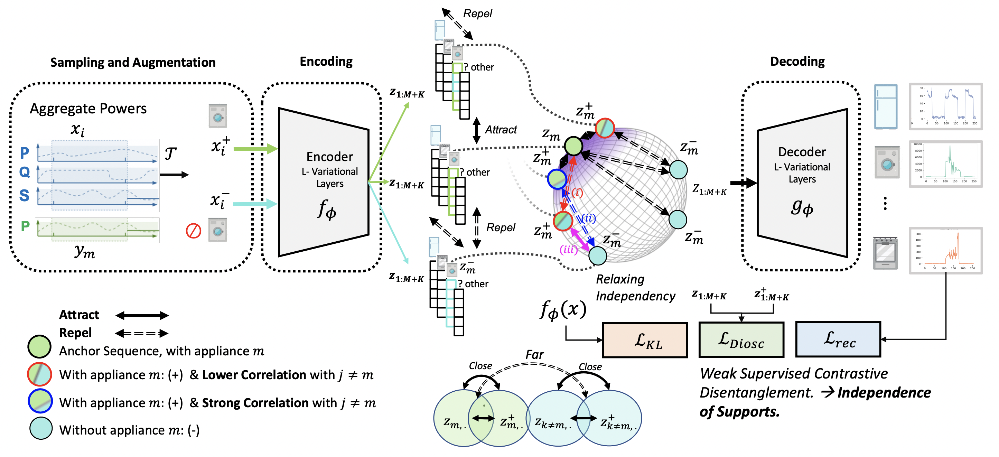

#  DIoSC: Disentangling Time Series Representations via Contrastive based $L$-Variational Inference
📣 Published as ICLR 2024 paper conference 

**Note ⚠️**
- Currently, we updated some classes of our  framework "DIoSC" Time Series Disentangling for correlated data.

At present, this repository remains anonymous as a paper based on its content is under review. It provides procedures to enhance the disentanglement of time series data, offering both configurations and the necessary code to reproduce our results.

| Loss               | Source                                                                                           |
| ------------------ | ------------------------------------------------------------------------------------------------ |
| Standard VAE Loss  | [Auto-Encoding Variational Bayes](https://arxiv.org/abs/1312.6114)                             |
| β-VAE<sub>H</sub>  | [β-VAE: Learning Basic Visual Concepts with a Constrained Variational Framework](https://openreview.net/pdf?id=Sy2fzU9gl)   |
| β-VAE<sub>B</sub>  | [Understanding disentangling in β-VAE](https://arxiv.org/abs/1804.03599)                       |
| FactorVAE          | [Disentangling by Factorising](https://arxiv.org/abs/1802.05983)                                |
| β-TCVAE            | [Isolating Sources of Disentanglement in Variational Autoencoders](https://arxiv.org/abs/1802.04942) |
|  HFS  | [https://openreview.net/forum?id=OKcJhpQiGiX](https://openreview.net/forum?id=OKcJhpQiGiX)                       |
|     RNN-VAE (VRNN)      | [A Recurrent Latent Variable Model for Sequential Data](https://proceedings.neurips.cc/paper_files/paper/2015/file/b618c3210e934362ac261db280128c22-Paper.pdf)                                |
| D3VAE            | [Generative Time Series Forecasting with Diffusion, Denoise, and Disentanglement](https://arxiv.org/abs/2301.03028) |
| DIoSC Time Series (ours)  | [Disentangling Time Series Representations via Contrastive based L-Variational Inference](#)                        |


## Installation

To get started with the Disentangling Time Series Energy codebase, follow these steps:

```shell
# Clone the repository
pip install -r requirements.txt
```

## Run
Use `python main.py <model-name> <param>` to train and/or evaluate a model. For example:

```
python main.py DIoSC_ukdal_mini -d ukdal -l DIoSC --lr 0.001 -b 256 -e 5
```

Predefined experiments with associated hyperparameters can be executed using the -x <experiment> flag. The hyperparameters can be found in the hyperparam.ini file, and pretrained models for each experiment are located in the results/<experiment> directory (created using ./bin/train_all.sh).

Output
Running experiments will create a directory results/<saving-name>/, which includes the following:

### use Checkpoint 

We offer checkpoints for each model, and we are actively working on providing access to other experiments using W&B as well.


### Help
```
usage: main.py ...

PyTorch implementation and evaluation of disentangled Variational AutoEncoders
and metrics.

optional arguments:
  -h, --help            show this help message and exit

General options:
  name                  Name of the model for storing or loading purposes.
  -L, --log-level {CRITICAL,ERROR,WARNING,INFO,DEBUG,NOTSET}
                        Logging levels. (default: info)
  --no-progress-bar     Disables progress bar. (default: False)
  --no-cuda             Disables CUDA training, even when have one. (default:
                        False)
  -s, --seed SEED       Random seed. Can be `None` for stochastic behavior.
                        (default: 1234)

Training specific options:
  --checkpoint-every CHECKPOINT_EVERY
                        Save a checkpoint of the trained model every n epoch.
                        (default: 30)
  -d, --dataset {mnist,fashion,dsprites,celeba,chairs}
                        Path to training data. (default: mnist)
  -x, --experiment {custom,debug,best_celeba,VAE_mnist,VAE_fashion,VAE_dsprites,VAE_celeba,VAE_chairs,betaH_mnist,betaH_fashion,betaH_dsprites,betaH_celeba,betaH_chairs,betaB_mnist,betaB_fashion,betaB_dsprites,betaB_celeba,betaB_chairs,factor_mnist,factor_fashion,factor_dsprites,factor_celeba,factor_chairs,btcvae_mnist,btcvae_fashion,btcvae_dsprites,btcvae_celeba,btcvae_chairs}
                        Predefined experiments to run. If not `custom` this
                        will overwrite some other arguments. (default: custom)
  -e, --epochs EPOCHS   Maximum number of epochs to run for. (default: 100)
  -b, --batch-size BATCH_SIZE
                        Batch size for training. (default: 64)
  --lr LR               Learning rate. (default: 0.0005)

Model specfic options:
  -m, --model-type {Burgess}
                        Type of encoder and decoder to use. (default: Burgess)
  -z, --latent-dim LATENT_DIM
                        Dimension of the latent variable. (default: 10)
  -l, --loss {VAE,betaH,betaB,factor,btcvae}
                        Type of VAE loss function to use. (default: betaB)
  -r, --rec-dist {bernoulli,laplace,gaussian}
                        Form of the likelihood ot use for each pixel.
                        (default: bernoulli)
  -a, --reg-anneal REG_ANNEAL
                        Number of annealing steps where gradually adding the
                        regularisation. What is annealed is specific to each
                        loss. (default: 0)

BetaH specific parameters:
  --betaH-B BETAH_B     Weight of the KL (beta in the paper). (default: 4)

BetaB specific parameters:
  --betaB-initC BETAB_INITC
                        Starting annealed capacity. (default: 0)
  --betaB-finC BETAB_FINC
                        Final annealed capacity. (default: 25)
  --betaB-G BETAB_G     Weight of the KL divergence term (gamma in the paper).
                        (default: 1000)

factor VAE specific parameters:
  --factor-G FACTOR_G   Weight of the TC term (gamma in the paper). (default:
                        6)
  --lr-disc LR_DISC     Learning rate of the discriminator. (default: 5e-05)

beta-tcvae specific parameters:
  --btcvae-A BTCVAE_A   Weight of the MI term (alpha in the paper). (default:
                        1)
  --btcvae-G BTCVAE_G   Weight of the dim-wise KL term (gamma in the paper).
                        (default: 1)
  --btcvae-B BTCVAE_B   Weight of the TC term (beta in the paper). (default:
                        6)

Evaluation specific options:
  --is-eval-only        Whether to only evaluate using precomputed model
                        `name`. (default: False)
  --is-metrics          Whether to compute the disentangled metrcics.
                        Currently only possible with `dsprites` as it is the
                        only dataset with known true factors of variations.
                        (default: False)
  --no-test             Whether not to compute the test losses.` (default:
                        False)
  --eval-batchsize EVAL_BATCHSIZE
                        Batch size for evaluation. (default: 1000)
```

